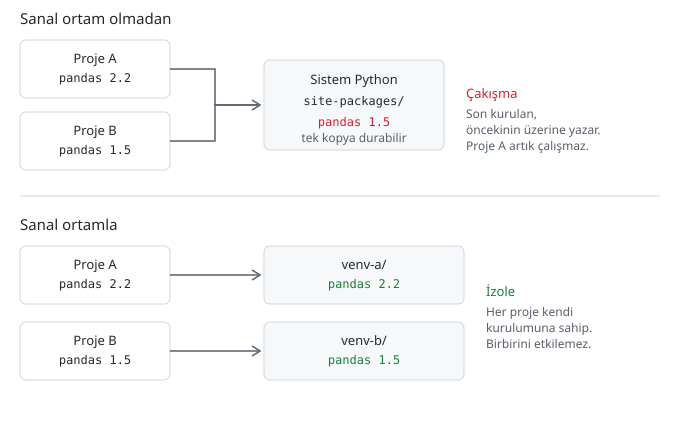

# Sanal ortam neden gerekli

> **Bu sayfa şunu çözer:** Sistemine doğrudan paket kurmanın neden zamanla soruna
> dönüştüğünü ve sanal ortamın bunu nasıl çözdüğünü anlarsın. Komutları bir sonraki
> sayfada göreceksin, burada sadece "neden" var.
> **Ön koşul:** [pip ile paket kurmak](02-pip-ile-paket-kurmak.md) · **Süre:** ~10 dakika

---

## Sorun: iki proje, tek sistem

Önceki sayfada bağımlılık kavramını tanımıştık — bir paketi kurunca onun ihtiyaç
duyduğu başka paketler de gelir. Sorun şu: iki farklı projenin aynı kütüphanenin
**farklı sürümlerine** ihtiyaç duyması hiç de nadir değildir. Biri eski bir eğitim
materyalinden kalma `pandas 1.5`, diğeri yeni başladığın proje `pandas 2.2` istiyor
olabilir.

Sistemine tek bir Python kuruluysa, o Python'un da tek bir `site-packages` klasörü
vardır — `pandas`'ın **tek bir** sürümü orada durabilir. İkinci projeyi kurduğunda,
ilk projenin ihtiyaç duyduğu sürümün üzerine yazılır.

## Sistem Python'una kurmanın diğer sorunları

Çakışma tek dert değil:

- **Artık paketler birikir.** Önceki sayfada gördüğün gibi `pip uninstall`
  bağımlılıkları temizlemez — zamanla sistemde ne için kurulduğu belirsiz onlarca
  paket birikir.
- **İşletim sistemini bozma riski.** Bazı işletim sistemleri kendi araçları için
  sistem Python'unu kullanır — bir önceki sayfada gördüğün
  `externally-managed-environment` kilidinin sebebi de bu. Sisteme rastgele paket
  kurup güncellemek bu araçları bozabilir.
- **"Temiz başlangıç" imkânsız.** Bir proje tuhaf davranmaya başladığında "en baştan
  kurayım" demek isteyebilirsin — sistem Python'unda bu, bütün bilgisayarını
  sıfırlamak anlamına gelir.

## Sanal ortam nedir

Sanal ortam, proje klasörüne ait, kendi `site-packages`'ı olan izole bir Python
kopyasıdır. Kulağa büyük bir teknoloji gibi gelse de sihir yok — sadece bir klasör ve
bir PATH düzenlemesi.

## Aktifleştirme ne yapıyor

Bir sanal ortamı "aktifleştirmek",
[Ortam değişkenleri ve PATH](../../terminal/01-gunluk-kullanim/03-ortam-degiskenleri-ve-path.md)
sayfasında öğrendiğin PATH mantığının aynısını kullanır: ortamın klasörünü **PATH'in
en başına** ekler. Bu sayede `python` ve `pip` yazdığında, kabuk PATH'i sırayla
tararken önce bu ortamın kendi Python'unu bulur — sistemdekini değil, o ortamdakini
çalıştırır. Aktifleştirmeyi kapattığında, PATH eski hâline döner.

## Ne zaman yeni ortam açılır

Kural basit: **proje başına bir ortam.** Yeni bir proje klasörüne başladığında, orada
da yeni bir sanal ortam kurulur. İki proje aynı ortamı paylaşırsa, sanal ortamın
çözdüğü sorunu (çakışma) baştan geri getirmiş olursun.

## Ortamı silmek = klasörü silmek

Bir sanal ortam sadece bir klasör olduğu için, bozulduğunda onu onarmaya çalışmak
yerine **silip yeniden kurmak** genelde daha hızlıdır. Neyin neyi bozduğunu araştırmak
saatler alabilir; klasörü silip birkaç dakikada yeniden kurmak çoğu zaman daha ucuza
gelir.

## Ortam klasörü Git'e gitmez, requirements.txt gider

Sanal ortam klasörü (genelde `venv/` ya da `.venv/` adında) projenle birlikte oluşur
ama **Git'e commit'lenmez** —
[.gitignore ve büyük dosyalar](../../git-github/01-gunluk-kullanim/05-gitignore-buyuk-dosyalar.md)
sayfasında anlatılan mantıkla `.gitignore`'a eklenir. Onun yerine paylaşılan şey,
hangi paketlerin hangi sürümde gerektiğini listeleyen bir `requirements.txt`
dosyasıdır — detayı
[requirements.txt ve bağımlılık dondurma](../01-gunluk-kullanim/02-requirements-ve-bagimliliklar.md)
sayfasında.

## Alternatifler

`venv`, bu depoda öğreteceğimiz standart araç — bir sonraki sayfada. Başka seçenekler
de var:

- **conda** — özellikle veri bilimi çevresinde yaygın, Python dışı bağımlılıkları da
  yönetebilir. [conda / Miniconda ne zaman tercih edilir](../01-gunluk-kullanim/01-conda-ne-zaman.md)
- **uv, poetry** — daha yeni, daha hızlı paket yöneticileri.
  [Modern paket yöneticileri](../02-ileri/01-modern-paket-yoneticileri.md)

Şimdilik hangisinin ne olduğunu bilmen yeterli — hangisini seçeceğin ilgili
sayfalarda.

## Sık yapılan hatalar

| Yanılgı | Sebebi | Doğrusu |
|---|---|---|
| "Sanal ortam kurdum, artık hep aktif" sanmak | Aktifleştirme kalıcı değil | Her yeni terminal oturumunda tekrar aktifleştirilmeli |
| Ortamı aktifleştirmeyi unutup paket kurmak | Aktif olup olmadığı fark edilmeyebilir | Aktifken kabuk satırının başında genelde ortam adı görünür (örn. `(venv)`) — ama bu göstergeyi göstermeyen özelleştirilmiş kabuk prompt'ları da vardır, garanti sayma. Kesin doğrulama: `which python` çalıştır; çıktı sanal ortamın klasörünü gösteriyorsa aktifsin, sistem Python'unu gösteriyorsa değilsin |
| Bir projede birden fazla sanal ortam biriktirmek | "Bir daha kurayım" alışkanlığı eskisini silmeden yenisini açar | Eskiyi sil, projede tek ortam kalsın |
| Sanal ortam klasörünü Git'e commit'lemek | `.gitignore`'a eklenmemiş | Ekle; onun yerine `requirements.txt` paylaş |

## Kafanda kalması gerekenler

- Sanal ortam = proje klasörüne özel, kendi `site-packages`'ı olan izole bir Python kopyası
- Sihir değil: bir klasör + PATH'in başına o klasörün eklenmesi
- Kural: proje başına bir ortam
- Bozulursa onarma, sil ve yeniden kur
- Ortam klasörü Git'e gitmez, `requirements.txt` gider

## Sonraki adım

→ [venv ile ortam oluşturma](04-venv-kullanimi.md)

---

Bu sayfada hata mı buldun? [Issue aç](https://github.com/Enes-CE/turkish-ai-handbook/issues/new/choose).
