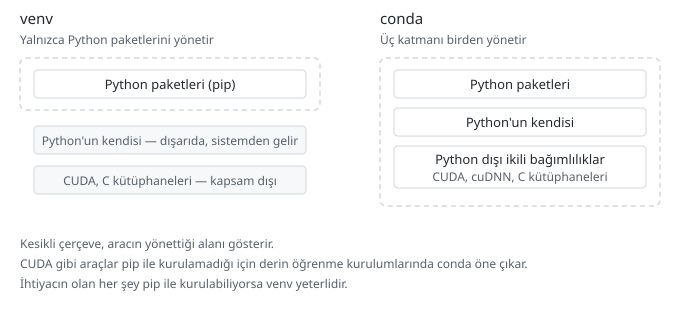
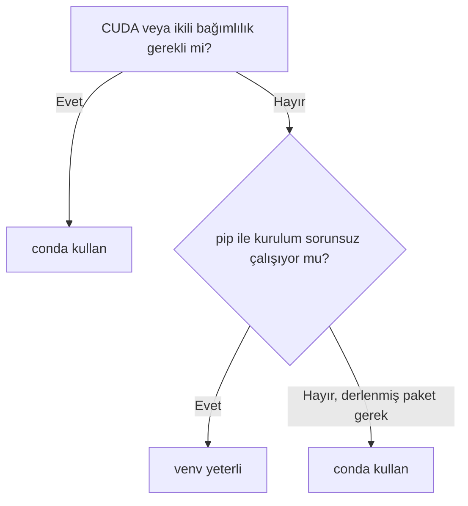

# conda / Miniconda ne zaman tercih edilir

> **Bu sayfa şunu çözer:** venv'i zaten biliyorsun — burada conda'nın ne zaman
> gerçekten gerektiğine, ne zaman gereksiz bir yük olduğuna karar veriyorsun. conda
> öğretmiyoruz, karar verdiriyoruz.
> **Ön koşul:** [venv ile ortam oluşturma](../00-temeller/04-venv-kullanimi.md) ·
> **Süre:** ~15 dakika

---

## conda nedir

venv sadece Python paketlerini yönetir — pip'in kurduğu her şey zaten Python'a
bağlanacak şekilde hazırlanmış olmalı. conda farklı: hem Python paket yöneticisi hem
ortam yöneticisi hem de Python'un **kendisini** ve Python dışı ikili bağımlılıkları
(C kütüphaneleri, CUDA araçları gibi) yönetebilen bir sistem.

CUDA gibi araçlar pip ile kurulamaz — bu, conda'yı ne zaman devreye sokacağının
pratik ölçütü.

## Anaconda vs Miniconda vs conda

Üçü sık karıştırılır:

- **conda** — araç, paket/ortam yöneticisinin adı.
- **Miniconda** — conda'nın minimal kurulumu; sadece conda + Python + birkaç temel
  paketle gelir.
- **Anaconda** — yüzlerce bilimsel paketle (pandas, numpy, scikit-learn, ...)
  önceden dolu, büyük bir dağıtım.

Yeni başlıyorsan **Miniconda** öner — Anaconda gigabaytlarca yer kaplar ve içindeki
paketlerin büyük çoğunluğunu muhtemelen hiç kullanmayacaksın. İhtiyacın olanı
`conda install` ile zaten sonradan kurabilirsin.

## Ne zaman conda gerekir

- Derin öğrenme kurulumlarında CUDA/cuDNN gibi Python dışı bağımlılıklar gerektiğinde
- Bazı bilimsel paketlerin, kaynak koddan derlemek yerine hazır derlenmiş (binary)
  sürümüne ihtiyaç duyduğunda
- Python dışı bir araç zincirine (örn. belirli bir derleyici sürümü) projenin bağımlı
  olduğu durumlarda

## Ne zaman venv yeter

- Standart Python projeleri: web uygulamaları, script'ler, otomasyon
- Çoğu veri analizi ve makine öğrenmesi işi (pandas, scikit-learn gibi paketler pip
  ile sorunsuz kurulur)
- Genel kural: pip ile kurulumda sorun yaşamıyorsan conda'ya ihtiyacın yok

## Temel komutlar: venv karşılıkları

| İşlem | venv | conda |
|---|---|---|
| Ortam oluşturma | `python -m venv venv` | `conda create -n proje-adi python=3.11` |
| Aktifleştirme | `source venv/bin/activate` | `conda activate proje-adi` |
| Deaktifleştirme | `deactivate` | `conda deactivate` |
| Paket kurma | `python -m pip install paket` | `conda install paket` |
| Kurulu paketleri listeleme | `pip list` | `conda list` |
| Ortamı silme | `rm -rf venv` | `conda env remove -n proje-adi` |

conda'da aktifleştirme, venv'deki gibi bir dosya `source`lamak değil — `conda
activate` doğrudan bir komut.

## conda ortamı nerede duruyor

venv'den önemli bir fark: venv klasörü proje klasörünün içinde durur (`venv/`),
conda ortamı ise proje klasöründe değil, **merkezi bir yerde** tutulur — bir ismi
vardır (`-n proje-adi`), bir klasör yolu değil.

Bunun sonucu: conda ortamını `.gitignore`'a eklemene gerek yok, çünkü zaten proje
klasörünün dışında. Onun yerine paylaşılan şey `environment.yml` dosyasıdır — venv
dünyasındaki `requirements.txt`'nin conda karşılığı. Detayı
[requirements.txt ve bağımlılık dondurma](02-requirements-ve-bagimliliklar.md)
sayfasında.

## pip ile conda'yı karıştırmak

Aynı conda ortamı içinde hem `conda install` hem `pip install` kullanmak mümkün ama
risklidir — ikisi birbirinden habersiz çalışır, biri diğerinin kurduğunu bozabilir.
Kural: **önce conda ile kurulabilecek her şeyi conda ile kur, sadece conda'da
olmayan paketler için pip'e geç** — tam tersi sırayla (önce pip, sonra conda)
çakışma ihtimali daha yüksektir.

## base ortamına kurulum yapma

> ⚠️ **conda kurulduğunda otomatik olarak `base` adında bir ortam aktif gelir.**
> Buraya doğrudan paket kurmak, venv'de sistem Python'una kurmakla aynı hatadır —
> her projenin `base`'e bağımlı hâle gelmesi, sanal ortamın çözdüğü sorunu geri
> getirir. Her proje için `conda create` ile ayrı bir ortam aç, `base`'i
> olabildiğince boş bırak.

## Karar akışı

Sorulacak tek soru aslında şu: "İhtiyacım olan şey pip ile kurulabiliyor mu?"
Kurulabiliyorsa venv yeter, kalabalık bir kuruluma gerek yok. Kurulamıyorsa (CUDA,
derlenmiş bilimsel paket) conda devreye girer.

## Sık yapılan hatalar

| Hata | Sebebi | Çözüm |
|---|---|---|
| Anaconda kurdum, disk doldu | Anaconda gigabaytlarca paketle geliyor | Miniconda kur, sadece ihtiyacın olanı ekle |
| `conda install` çok yavaş, dakikalarca "Solving environment" | Bağımlılık çözümleme karmaşık | Sabırlı ol; ihtiyaç sürekliyse daha hızlı bir çözümleyici araştırmayı düşün (bu depoda ayrıca işlenmiyor) |
| pip ile kurduğum paket conda ortamında görünmüyor | conda ve pip birbirinden habersiz çalışıyor olabilir | Önce conda ile kurulabilecekleri conda ile kur, sadece gerekirse pip'e geç |
| `base` ortamı şişti, her şey karışık | Doğrudan `base`'e paket kurulmuş | Yeni bir `conda create` ile temiz bir ortam aç, `base`'i boşalt |

## Kendin dene

Conda kurulu olmayabilir — bu alıştırma onsuz da yapılabilir.

1. Şu anki (ya da yakın zamanda çalıştığın) bir projeyi düşün: CUDA/cuDNN gerektiren
   bir derin öğrenme kurulumu mu, yoksa standart bir web/veri projesi mi?
2. Yukarıdaki karar akışını o projeye uygula — venv mi conda mı çıktı?
3. Conda kuruluysa: `conda create -n deneme python=3.11` ile bir ortam oluştur,
   `conda env list` ile listede göründüğünü doğrula, sonra `conda env remove -n deneme`
   ile kaldır.

## Sonraki adım

→ [requirements.txt ve bağımlılık dondurma](02-requirements-ve-bagimliliklar.md)

---

Bu sayfada hata mı buldun? [Issue aç](https://github.com/Enes-CE/turkish-ai-handbook/issues/new/choose).
