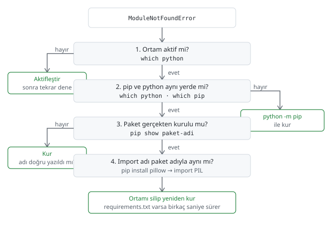

# Ortam sorunlarını çözmek

> **Bu sayfa şunu çözer:** `ModuleNotFoundError` ve benzeri ortam hatalarıyla
> karşılaştığında izleyeceğin adım adım teşhis yöntemini, en yaygın nedenleri ve ne
> zaman ortamı silip yeniden kuracağını öğrenirsin. Bu bölümün en çok başvuracağın
> sayfası — sorun yaşarken buraya dön.
> **Ön koşul:** [requirements.txt ve bağımlılık dondurma](02-requirements-ve-bagimliliklar.md) ·
> **Süre:** ~20 dakika

---

Bir paket kurdun, `import` ettin, yine de `ModuleNotFoundError` aldın — bu en
yaygın ortam hatası ve genelde dört sebepten biri var. Aşağıdaki akış, bu dört
ihtimali sırayla eler:



Şimdi her adımı tek tek açalım.

## 1. Ortam aktif değil

En sık sebep bu. `which python` çalıştır — proje klasöründeki `venv/`'i
göstermiyorsa (ya da bir sonucu yoksa) ortam aktif değildir.
[venv ile ortam oluşturma](../00-temeller/04-venv-kullanimi.md) sayfasındaki
işletim sistemine uygun komutla aktifleştir, sonra tekrar dene.

## 2. pip ve python farklı kurulumlara bağlı

Ortam aktif olsa bile, `pip` ile `python`'ın farklı yerlere işaret ettiği durumlar
olur — özellikle birden fazla Python kuruluysa. Kontrol:

```bash
which python
which pip
```

İkisi de aynı `venv/` klasörünü göstermeli. Göstermiyorsa, paket "kurulur" ama
başka bir Python'a kurulur — `import` eden Python onu hiç görmez.

Kalıcı çözüm, [Python kurulumu](../00-temeller/01-python-kurulumu.md) ve
[pip ile paket kurmak](../00-temeller/02-pip-ile-paket-kurmak.md) sayfalarında
önerdiğimiz alışkanlık: `pip install` yerine her zaman `python -m pip install`
yaz. Bu, "hangi Python çalışıyorsa onun pip'ini kullan" der — iki farklı kuruluma
bağlanma riskini ortadan kaldırır.

## 3. Paket gerçekten kurulu değil

Bazen sebep basittir — paket hiç kurulmamış ya da kurulum sırasında hata almış,
fark edilmemiş.

```bash
pip show paket-adi
```

`WARNING: Package(s) not found` alırsan paket kurulu değil demektir. İki olası
sebep:

- Kurulum hiç çalıştırılmadı ya da sessizce başarısız oldu — `pip install`
  çıktısını yukarı kaydırıp hata olup olmadığına bak.
- Paket adı tamamen yanlış. pip, büyük/küçük harf ve tire/alt çizgi farklarını
  normalleştirir — `scikit_learn` da `scikit-learn` da aynı pakete gider, bunlar
  sorun çıkarmaz. Asıl karıştırılan şey PyPI'daki **kurulum adı** ile Python
  içindeki **import adı**: `pip install sklearn` çalışmaz (PyPI'da böyle bir paket
  yok), doğrusu `pip install scikit-learn`'dür. Bu ayrım bir sonraki bölümün konusu.

## 4. Import adı paket adından farklı

En kafa karıştıran sebep, çoğu zaman en son akla gelen. Bazı paketlerin PyPI'daki
kurulum adıyla Python içindeki `import` adı **farklıdır**:

| Kurulum adı (`pip install ...`) | Import adı (`import ...`) |
|---|---|
| `pillow` | `PIL` |
| `scikit-learn` | `sklearn` |
| `opencv-python` | `cv2` |
| `beautifulsoup4` | `bs4` |
| `pyyaml` | `yaml` |
| `python-dotenv` | `dotenv` |

Bu tabloda olmayan bir paketle karşılaşırsan, paketin PyPI sayfasındaki
"Quickstart" ya da "Usage" örneği genelde import adını hemen gösterir.

## Yanlış yorumlayıcı seçimi (VS Code)

Terminalde `which python` doğru ortamı gösterse bile, VS Code'un kendi çalıştırdığı
Python farklı olabilir — editör, sağ alttaki yorumlayıcı seçiciyle ayrı bir
Python'a bağlanmış olabilir. Terminal doğru, editör yanlış olduğunda kod çalışır
ama editördeki kırmızı çizgiler ("import bulunamadı" uyarıları) yanıltıcı olur.
Ayarları [VS Code](../../vscode/README.md) bölümünde.

## Sürüm çakışması: "dependency resolver" uyarıları

`pip install` sırasında bazen şuna benzer bir uyarı görürsün:

```
ERROR: pip's dependency resolver does not currently take into account all the packages that are installed...
```

Bu, kurduğun paketin, ortamda zaten kurulu başka bir paketin ihtiyaç duyduğu
sürümle çakıştığı anlamına gelir. **Görmezden gelinebilir:** uyarı sadece bir
uyarıysa (kurulum yine de tamamlandıysa) ve iki paket de birbirini gerçekten
kullanmıyorsa, çoğu zaman sorun çıkmaz. **Görmezden gelinemez:** kurulumdan hemen
sonra `ImportError` ya da beklenmedik davranışlarla karşılaşıyorsan, bu uyarı
gerçek bir çakışmaya işaret ediyordur —
[Sürüm sabitleme stratejileri](02-requirements-ve-bagimliliklar.md) bölümündeki
yaklaşımla sürümleri elle uyumlu hâle getir.

## Bozuk ortamı onarmaya çalışma, sil ve yeniden kur

Yukarıdaki dört adımı denedin, hâlâ çözülmedi, ya da ortam öyle karışmış ki
nereden başlayacağını bilmiyorsun — bu noktada onarmaya çalışmak zaman kaybı
olabilir. [Sanal ortam neden gerekli](../00-temeller/03-sanal-ortam-nedir.md)
sayfasında söylediğimiz gibi, bir ortam sadece bir klasördür:

```bash
deactivate
rm -rf venv
python -m venv venv
source venv/bin/activate
python -m pip install -r requirements.txt
```

`requirements.txt`'in varsa ([requirements.txt ve bağımlılık dondurma](02-requirements-ve-bagimliliklar.md)
sayfasında oluşturmuştun) bu işlem birkaç saniye sürer — maliyet neredeyse sıfır.
Bu yüzden bozuk bir ortamı saatlerce didiklemek yerine, beş dakikada silip
yeniden kurmayı dene.

## Windows'a özel sorunlar

Kısaca üç yaygın durum:

- **Uzun yol sınırı.** Windows'ta bazı eski kurulumlarda dosya yolları belirli bir
  uzunluğu geçemez; derin iç içe klasörlerde kurulum hataları görülebilir.
- **İzin hataları.** `PermissionError` alırsan, dosyayı başka bir program (editör,
  antivirüs taraması) kullanıyor olabilir; kapatıp tekrar dene.
- **Antivirüs müdahalesi.** Bazı antivirüs programları, kurulum sırasında
  oluşturulan dosyaları geçici olarak kilitleyip yanlışlıkla `PermissionError`'a
  yol açabilir. Sorun tekrarlıyorsa `venv/` klasörünü antivirüs taramasından
  geçici olarak muaf tutmayı dene.

## Genel yöntem: değişkenleri teker teker sabitle

Hiçbiri işe yaramadığında izlenecek genel strateji: aynı anda çok şeyi
değiştirmeye çalışma. Bir seferde tek bir şeyi değiştir, sonucu gözlemle. Sorunu
üreten **en küçük** örneği bulmaya çalış — 500 satırlık bir script yerine, sorunu
3 satırda tekrar üretebiliyorsan hem sen hem yardım isteyeceğin kişi çok daha
hızlı ilerler.

## Sık yapılan hatalar

| Hata | Sebebi | Çözüm |
|---|---|---|
| `ModuleNotFoundError` — paketi kurduğumdan eminim | Ortam aktif değil ya da pip/python farklı kurulumlara bağlı | `which python` ve `which pip` ile ikisinin aynı yeri gösterdiğini doğrula |
| `pip show paket` "not found" diyor ama kurulum "Successfully installed" dedi | Kurulum farklı bir Python'a gitti | `python -m pip install` ile yeniden kur |
| `import cv2` "No module named cv2" diyor, ama `opencv-python` kurulu | Kurulum adı ile import adı farklı | Yukarıdaki tabloya bak |
| Hiçbir şey işe yaramıyor, ortam tamamen karışmış | Üst üste denemeler ortamı karmaşıklaştırmış | Sil ve yeniden kur — `requirements.txt` varsa hızlı |

## Kendin dene

Bilerek bir hata üretip yukarıdaki teşhis akışını uygula. Baştan kuruyoruz, önceki
sayfalardan kalma bir ortama güvenmiyoruz:

1. `mkdir teshis-deneme && cd teshis-deneme` ile yeni, boş bir klasör oluştur.
2. `python -m venv venv` ile ortamı kur, işletim sistemine uygun komutla
   aktifleştir ([venv ile ortam oluşturma](../00-temeller/04-venv-kullanimi.md)).
3. `python -m pip install cowsay` çalıştır. (`requests` değil — daha önceki bir
   alıştırmada sisteme kurup kaldırmayı unutmuş olabilirsin, bu da aşağıdaki testi
   geçersiz kılar. `cowsay` sisteme kurulu olma ihtimali çok daha düşük.)
4. `deactivate` çalıştır.
5. `python -c "import cowsay"` çalıştır — `ModuleNotFoundError` alırsın, çünkü
   `cowsay` sadece `venv/` içine kurulmuştu, sisteme değil.
6. `which python` çalıştır — proje klasöründeki `venv/`'i göstermediğini, sistem
   Python'unu gösterdiğini gör. Bu, akıştaki 1. adımın gerçek hayattaki karşılığı.
7. Ortamı tekrar aktifleştir, `python -c "import cowsay"` çalıştır — bu sefer
   hatasız çalışır.

## Sonraki adım

→ [Modern paket yöneticileri (uv, poetry)](../02-ileri/01-modern-paket-yoneticileri.md)

---

<sub>Bu sayfada hata mı buldun? [Issue aç](https://github.com/Enes-CE/turkish-ai-handbook/issues/new/choose).</sub>
