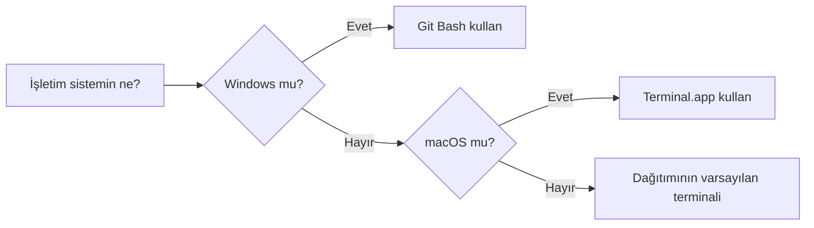

# Terminal nedir, neden gerekli

> **Bu sayfa şunu çözer:** Terminalin ne olduğunu, günlük dosya gezgini kullanımından farkını
> ve yapay zekâ/veri işlerinde neden kaçınılmaz olduğunu anlarsın. Komut ezberlemeden önce
> bu resmi net görmek, ilerideki her şeyi kolaylaştırır.
> **Ön koşul:** yok · **Süre:** ~10 dakika

---

## Aynı dosyalara başka bir kapı

Terminal yeni bir dünya değil. Zaten yaptığın işi, tıklama yerine yazarak yapmanın bir yolu:

```
Masaüstü (GUI)                          Terminal (CLI)
──────────────────                      ──────────────────
1. Dosya Gezgini'ni aç                  1. cd Belgeler
2. "Belgeler" klasörüne çift tıkla      2. ls
3. İçindeki dosyaları gör

              → İkisi de aynı şeyi yapıyor:
                Belgeler klasörünün içeriğini görmek
```

Fark yöntemde, hedefte değil. Aynı dosya sistemine, sadece başka bir kapıdan giriyorsun.

## Terminal neden hâlâ var

GUI daha kolayken terminal neden hâlâ kullanılıyor:

- **Otomasyon.** Aynı işi 100 dosyaya tıklayarak değil, tek bir komutla yaparsın.
- **Uzak makine.** Bir sunucuda çalışan bilgisayarın çoğu zaman ekranı bile yok — ona sadece
  terminalden (SSH ile) ulaşabilirsin.
- **Tekrarlanabilirlik.** Bir komut dizisini bir script dosyasına yazıp arkadaşınla paylaşabilirsin;
  "şuraya tıkla, sonra buraya tıkla" paylaşılamaz.
- **Araçların çoğu sadece terminalden çalışır.** `pip`, `git`, `conda` gibi araçların çoğunun
  hiç grafik arayüzü yok — tek arayüzleri komut satırı.

## Yapay zekâ ve veri işlerinde neden kaçınılmaz

- Paket kurulumu (`pip install ...`)
- Sanal ortam oluşturma ve etkinleştirme
- Git ile sürüm kontrolü
- Bir sunucuda saatlerce sürecek model eğitimini başlatmak
- Colab hücresinde başına `!` koyup terminal komutu çalıştırmak (`!pip install ...`)

Bu depodaki [Python Ortamları](../../python-ortamlari/README.md) ve
[Git & GitHub](../../git-github/README.md) bölümlerinin neredeyse tamamı terminal üzerinden işler.

## Terminal, kabuk ve komut satırı — kim kim

Üç terim iç içe geçer, günlük konuşmada birbirinin yerine kullanılsa da sorun değil.
Ama arkada ne olduğunu bilmek işine yarar:

```
┌───────────┐              ┌───────────────────┐              ┌─────────────────┐
│ Kullanıcı │    yazar     │ Terminal          │   yorumlar   │ Kabuk (shell)   │
│           │─────────────►│ (açtığın pencere, │─────────────►│ bash, zsh gibi  │
│           │              │ uygulama)         │              │ komutu yorumlar │
└───────────┘              └───────────────────┘              └─────────────────┘
                                                                       │
                                                                  çalıştırır
                                                                       │
                                                                       ▼
                                                              ┌─────────────────┐
                                                              │ İşletim sistemi │
                                                              └─────────────────┘
```

**Terminal**, açtığın pencere/uygulama. **Kabuk (shell)**, o pencerenin içinde yazdığın
komutu okuyup işletim sistemine ileten program. **Komut satırı**, genel olarak bu şekilde
çalışma biçiminin adı. Bu depoda üçü de aynı anlamda kullanılabilir.

## Hangi terminali açacaksın



- **Windows:** Başlat menüsünde "Git Bash" ara, ya da bir klasörde sağ tıklayıp
  **Git Bash Here** seç. Git kurulu değilse önce
  [kurulum sayfasına](../../git-github/00-temeller/02-kurulum-ve-ilk-ayarlar.md) bak —
  Git Bash, Git'le birlikte kurulur ve bu depodaki bütün komutlar onun sözdizimiyle yazılıyor.
- **macOS:** Uygulamalar → İzlenceler → Terminal, ya da Spotlight'ı aç (`Cmd+Space`) ve
  "Terminal" yaz. Varsayılan kabuk zsh, komutlar aynı çalışır.
- **Linux:** `Ctrl+Alt+T` ya da uygulama menüsünden "Terminal". Kabuk genelde bash.

Bu rehberdeki bütün komutlar Bash uyumlu bir kabukta çalışacak şekilde yazılıyor.

## İlk birkaç komut

Amaç komut ezberlemek değil, korkulacak bir şey olmadığını görmek. Üçü de sadece bilgi
gösterir, hiçbir şeyi değiştirmez:

```bash
pwd
```

Beklenen çıktı: bulunduğun klasörün tam yolu (örn. `/c/Users/adin`)

```bash
ls
```

Beklenen çıktı: o klasördeki dosya ve klasörlerin listesi

```bash
whoami
```

Beklenen çıktı: kullanıcı adın

## Kendin dene

Sırayla `pwd`, `ls` ve `whoami` komutlarını çalıştır. Üçünün çıktısında da şunları
görüyorsan terminalin sorunsuz çalışıyor demektir: bulunduğun klasörün yolu, o klasördeki
dosya listesi ve kendi kullanıcı adın. Amaç bu üç komutu ezberlemek değil, terminalle ilk
temasının sorunsuz geçtiğini doğrulamak.

## "Yanlış komut yazarsam bilgisayarı bozar mıyım?"

Dürüst cevap: çoğu komut sadece **okur**, hiçbir şeyi değiştirmez — `pwd`, `ls`, `cd`,
`whoami`, `cat` bunlardan. Yanlış yazarsan olsa olsa `command not found` hatası alırsın.

Gerçekten dikkat gerektiren komutlar azdır ve genelde bir şeyi **siler ya da üzerine yazar**:
`rm -rf`, `git reset --hard` gibi. Bu depoda böyle bir komut geçtiğinde başında mutlaka
⚠️ uyarı kutusu olur. Uyarı yoksa komut zararsızdır.

## Sık yapılan hatalar

| Hata | Sebebi | Çözüm |
|---|---|---|
| Komut yazdım, imleç yanıp sönüyor, hiçbir şey olmuyor | Komut bir girdi bekliyor ya da çıktıyı sayfalıyor | `q` tuşuna bas, olmazsa `Ctrl+C` |
| `command not found` | Komut yanlış yazıldı ya da program kurulu değil | Yazımı kontrol et, gerekiyorsa program kurulur |
| Ekran bomboş, önceki komutlar kayboldu | Yanlışlıkla `clear` yazıldı | Veri kaybı yok, sadece ekran temizlendi; yukarı kaydırarak geçmişi görebilirsin |
| Bu rehberdeki komut Windows'ta çalışmıyor | PowerShell'de çalıştırılıyor | Git Bash aç, PowerShell değil |

## Kafanda kalması gerekenler

- Terminal, dosyalarına GUI dışında ikinci bir kapı — yeni bir dünya değil
- Terminal = pencere, kabuk (shell) = komutu yorumlayan program
- Çoğu komut sadece okur, zararsızdır; tehlikeli olanlar her zaman uyarıyla gelir
- Bu depoda Windows için Git Bash kullanılıyor

## Sonraki adım

→ [Dosya sistemi ve yol kavramı](02-dosya-sistemi-ve-yol.md)

---

<sub>Bu sayfada hata mı buldun? [Issue aç](https://github.com/Enes-CE/turkish-ai-handbook/issues/new/choose).</sub>
