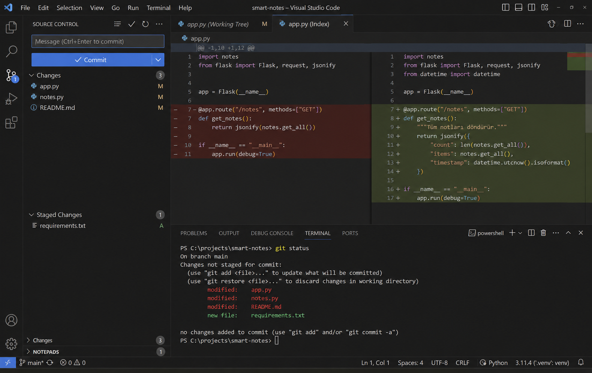

# Entegre terminal ve Git arayüzü

> **Bu sayfa şunu çözer:** Terminal ve Git'i zaten komut satırından biliyorsun —
> burada bunların VS Code içindeki karşılıklarını görüyorsun. Yeni bir kavram
> yok, bilinenin arayüzdeki hâli var.
> **Ön koşul:** [İlk repo, ilk commit](../../git-github/00-temeller/03-ilk-repo-ilk-commit.md) ·
> **Süre:** ~15 dakika

---

## Entegre terminal

### Açma, birden fazla sekme, bölme

Önceki sayfada `` Ctrl+` `` ile terminal açmayı gördün. `+` işaretiyle ikinci bir
terminal sekmesi açabilir, bölünmüş görünümle (split) iki terminali yan yana
çalıştırabilirsin.

### Hangi kabuk kullanılıyor

Windows'ta VS Code'un varsayılan entegre terminali PowerShell olabilir —
[Windows'ta terminal seçenekleri](../../terminal/01-gunluk-kullanim/04-windows-terminal-secenekleri.md)
sayfasında öğrendiğin gibi, bu depo Git Bash'i öneriyor. Değiştirmek için komut
paleti: `Terminal: Select Default Profile`, listeden Git Bash'i seç. Yeni
açtığın terminaller artık Git Bash olur (açık olanlar etkilenmez).

### Çalışma dizini

Önceki sayfada gördüğün gibi, entegre terminal çalışma alanı klasöründe açılır —
VS Code'da hangi klasörü açtıysan, terminal orada başlar.

### Neden entegre terminal

Ayrı bir terminal penceresi yerine VS Code içindekini kullanmanın avantajı: aynı
bağlamda kalırsın (pencereler arası geçiş yok), dosya yolları terminalde
tıklanabilir hâle gelir, hata çıktısındaki bir dosya adına tıklayınca o dosya
doğrudan editörde açılır.

## Git arayüzü: Kaynak Denetimi paneli

Kenar çubuğundaki Kaynak Denetimi (Source Control) simgesi, değişen dosyaların
listesini gösterir —
[Değişiklikleri takip etmek](../../git-github/00-temeller/04-degisiklikleri-takip-etmek.md)
sayfasında `git status` ile terminalde gördüğün şeyin görsel hâli.

### Panel işlemleri ↔ Git komutları

| Panelde | Terminalde |
|---|---|
| Dosyanın yanındaki `+` (Stage Changes) | `git add dosya` |
| Mesaj yazıp ✓ (Commit) | `git commit -m "mesaj"` |
| Sync düğmesi | `git pull` + `git push` |
| Dal adına tıklayıp seçim | `git switch dal-adi` |

[İlk repo, ilk commit](../../git-github/00-temeller/03-ilk-repo-ilk-commit.md) ve
[GitHub'a bağlanmak](../../git-github/00-temeller/05-github-baglanti.md)
sayfalarında bu komutları zaten öğrenmiştin — panel, aynı işlemleri tıklayarak
yapmanın yolu.

### Diff görüntüleme

Değişen bir dosyaya tıklayınca, eski ve yeni hâli yan yana açılır — `git diff`'in
görsel hâli, ve satır satır renklendirilmiş olduğu için çoğu zaman terminal
çıktısından daha okunaklı.

### Satır bazlı stage etme

Diff görünümündeki `+`/`-` işaretleri sadece eklenen/silinen satırları gösterir,
tıklanacak bir düğme değildir. Sadece belirli satırları stage'lemek istersen:
stage'lemek istediğin satırları seç, sağ tıkla → **Stage Selected Ranges** (komut
paletinden de erişebilirsin: `Git: Stage Selected Ranges`). Bu, terminaldeki
`git add -p`'nin (interaktif, parça parça stage etme) görsel karşılığı.

### Dal değiştirme

Durum çubuğunda (sol altta) o an bulunduğun dalın adı görünür — tıklayınca dal
değiştirme/oluşturma menüsü açılır.

## Arayüzün gizlediği şeyler

> ⚠️ **Tek tıkla "Sync" yapmak, aslında `git pull` ve ardından `git push`
> demektir** — iki ayrı işlem tek düğmeye sıkıştırılmış. Arayüz bunu
> göstermiyor, sadece "Sync" yazıyor. `pull` sırasında çakışma çıkabilir; arayüz
> o an aslında iki komutun art arda çalıştığını bilmeni beklemez, ama bir şeyler
> ters gittiğinde bunu bilmek fark yaratır. Arayüz hız kazandırır, komutları
> öğrenmenin yerini tutmaz.

## Ne zaman arayüz, ne zaman komut satırı

- Basit commit/push, günlük değişiklik takibi → arayüz hızlı ve yeterli
- rebase, reset, reflog gibi geri alma işlemleri (bkz.
  [Git & GitHub](../../git-github/README.md) bölümü) için komut satırı daha
  şeffaf — arayüz bu işlemlerde ne olduğunu tam göstermeyebilir, komut
  satırında her adımı görürsün

## Sık yapılan hatalar

| Hata | Sebebi | Çözüm |
|---|---|---|
| Sync'e bastım, beklenmedik bir commit geldi | Sync aslında pull+push, pull sırasında başkasının değişikliği geldi | Sync'ten önce panelde gelen değişiklikleri gözden geçir |
| Terminalde Git Bash'e alışkınım ama entegre terminal PowerShell açıyor | Varsayılan profil değiştirilmemiş | `Terminal: Select Default Profile` ile Git Bash seç |
| Stage ettiğim satırlar yanlış | Satır bazlı stage'de yanlış bloğa tıklanmış | Diff görünümünde hangi `+`'ya tıkladığını kontrol et, `git diff --staged` ile terminalde doğrula |
| Mesaj kutusu boşken ✓'ya bastım, bir `COMMIT_EDITMSG` dosyası açıldı | VS Code, boş mesajla commit atmak yerine mesaj yazman için bir düzenleyici sekmesi açar | Sekmede commit mesajını yaz, dosyayı kaydedip kapat — commit o zaman tamamlanır |

## Kendin dene

1. Bir Git deposunda küçük bir değişiklik yap (örn. bir dosyaya bir satır ekle).
2. Kaynak Denetimi panelini aç, değişikliği gör, `+` ile stage'le.
3. Bir commit mesajı yaz, ✓ ile commit'le.
4. Entegre terminalde `git log --oneline` çalıştır — az önce panelden attığın
   commit'in orada göründüğünü doğrula. Bu, iki yolun aynı şeye vardığının kanıtı.

## Sonraki adım

→ [Notebook'ları VS Code'da çalıştırmak](../01-gunluk-kullanim/01-notebook-calistirmak.md)

---

Bu sayfada hata mı buldun? [Issue aç](https://github.com/Enes-CE/turkish-ai-handbook/issues/new/choose).
